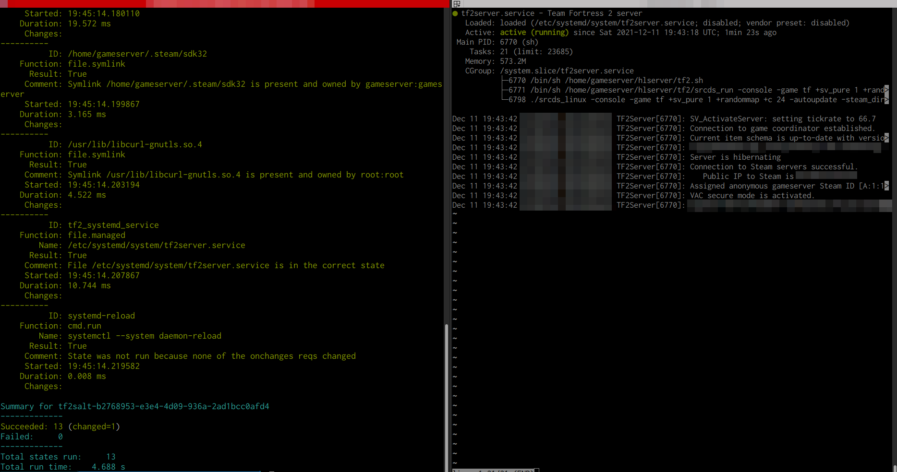

# tf2salt - Team Fortress 2 Server Deploy with Salt!

The meaning of this project is to provide orchestrated way to provision and prepare an instance to be ready and execute the SteamCMD binary, which then is used to download, and update the required resources to provision the Team Fortress 2 gameserver. 

## What it does?

- Provides a stable way to deploy a Team Fortress 2 game server on CentOS 8 OS
- Includes SystemD files that handle restarts and automatic updates
- Is configured to run under less privileged user
- Has a simple configurator-tool, that can be easily expanded
- You may also import your own server configs
- Configuration should be made easier, if possible
- Is Salt -compatible!

## Deployment

- Deploy a fresh Centos 8.X series server
- Configure the instance to be a SaltStack minion. If you want to test how this works, in the development folder there is a Vagrantfile provided that can deploy a suitable test instance.
- Clone this repository into a place, where the Salt master may look for it e.g: `/srv/salt/tf2salt`
- Before applying the states, run configurator.py to create server.cfg or just instead add your own server.cfg. Server.cfg is untracked in .gitignore.
- Apply state: `sudo salt -l debug tf2salt-XXXXX-XXXXX-XXXXX-XXXXX-XXXXX state.apply tf2salt -v`
- Note: the previous step may take 5-30 minutes of your time, because it will download and update the required game resources on the first run. How long this takes depends on your resources.
- Execute: `sudo systemctl start tf2server`. The server binds to all your interfaces and is available in a moment.
- Connect with: `connect 123.123.123.123` from your game development console.

## How am I supposed to get the server listed?

You need to add one more parameter which is the `+sv_setsteamaccount` which you may receive here: https://steamcommunity.com/dev/managegameservers

Otherwise it's possible to simply share the server IP address with your friends.

## Testing with Vagrant

If you want to test how this works with Vagrant, in the development folder there is a Vagrantfile provided that can deploy a suitable test instance.

## System requirements

During testing it was found, that the following system requirements should suffice. It should be noted that this project is designed to be ran with CentOS 8.3 at the moment of it's creation.

- 3 vCPU/CPU
- 4096 MB of RAM
- At least 25 GB of disk space

## Default firewalld -configuration

The following firewalld -configuration is offered in this project automatically. To allow SSH traffic, Salt-traffic and the game server traffic:

- 27015/tcp
- 27015/udp
- 4506/tcp
- 4505/tcp
- 22/tcp
- 22/udp

## Configuration tips and information about SteamCMD

For Team Fortress 2 Linux Dedicated server information, you may look here, for example about firewall configuration which is not covered here:

https://wiki.teamfortress.com/wiki/Linux_dedicated_server

For the more extensive guide on SteamCMD, you may look here:

https://developer.valvesoftware.com/wiki/SteamCMD

## Screenshot

Below you may see the project up and running after the state file has been executed via Salt master, and that the SystemD service file is working correctly.

